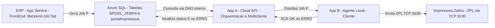
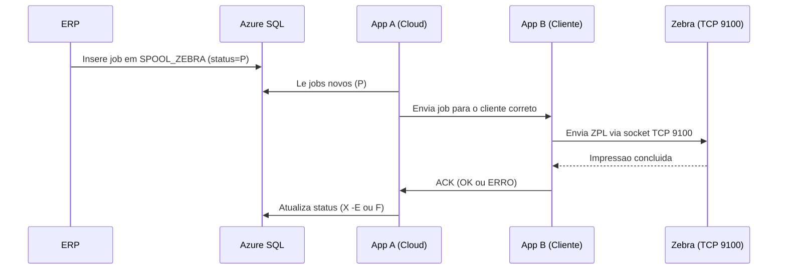
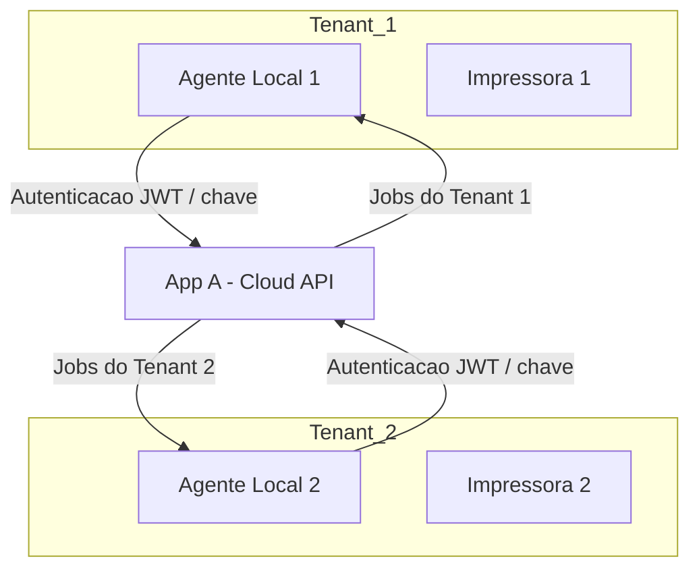

# 📘 Documentação Oficial — Arquitetura de Impressão Zebra (Saveinformatica)

**Versão 1.0 — Formato Markdown **  
**Data:** 18/02/2026  
**Autor:** André Di Battista 

---

## 1. 🎯 Resumo Executivo

A Saveinformatica necessita substituir o aplicativo local “**savecloud**”, que acessa diretamente o banco de dados de produção e cria tabelas temporárias com privilégios elevados, por uma arquitetura **segura**, **multicliente** e **totalmente desacoplada** do banco.

A nova solução utiliza:

- **Aplicativo Cloud (App A)** — responsável por orquestrar jobs, registrar impressoras, e atualizar o ERP.  
- **Agente Local (App B)** — rodando no cliente, responsável por imprimir localmente o ZPL/PRN e confirmar execução.

---

## 2. 🧱 Arquitetura Geral da Solução

### 2.1 Visão Geral — Diagrama (Mermaid)

---

## 3. 🖨️ Fluxo Completo de Impressão

### 3.1 Diagrama de Fluxo do Job

---

## 4. 🏗️ Componentes da Solução

### 4.1 App A — Cloud

Responsável por:

- Autenticação multicliente.  
- Registro e health das impressoras.  
- Consulta da tabela `SPOOL_ZEBRA` (status = P).  
- Distribuição de jobs para o agente local correto.  
- Recebimento do ACK local e atualização do banco.

### 4.2 App B — Agente Local

Responsável por:

- Registrar a impressora local com o App A.  
- Solicitar jobs pendentes.  
- Imprimir via **ZPL na porta TCP 9100** (caminho oficial Zebra).  
- Enviar ACK ao App A com status final.  
- Implementar retries/queue local.

> **Nota sobre ZPL/PRN:** para Zebra, “PRN” normalmente significa o **conteúdo ZPL bruto** que pode ser enviado diretamente para a impressora (rede → TCP 9100) ou por utilitários/driver; é a forma mais simples e performática em ambiente de rede.

---

## 5. 🛡️ Segurança e Multitenancy

**Regras principais:**

- Nenhum cliente acessa o banco diretamente; todo IO passa pela API (App A).  
- Isolamento forte por **tenant** (escopos e claims).  
- Impressoras Zebra com protocolos legados desativados (via PrintSecure/SGD):  
  - `ip.telnet.enable=off`  
  - `ip.ftp.enable=off`  
  - `ip.snmp.enable=off`

---

## 6. 🧪 Observabilidade e Confiabilidade

- Idempotência por **CHAVE** única (já existente no SPOOL).  
- Retentativas com backoff exponencial no agente.  
- Dead-letter queue no App A.  
- Logs estruturados: tenant, impressora, job, latência, erros.  
- Métricas: tempo até imprimir, falhas, status das impressoras.

---

## 7. 📮 Contatos

- **Responsável técnico:** André Di Battista  
- **Stack:** Azure App Service (App A), Agente Local (Windows/Linux), Impressoras Zebra (ZPL/9100)

