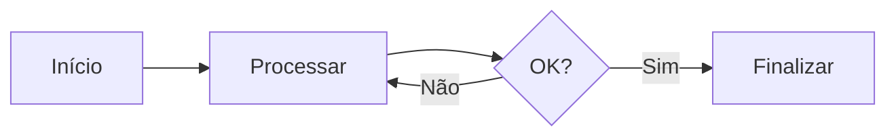
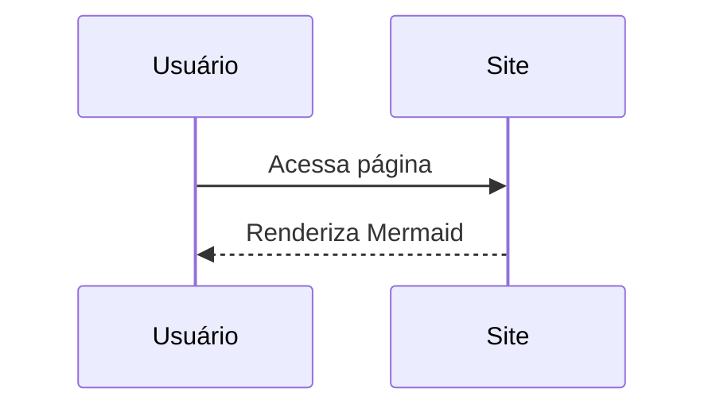

# Teste Mermaid

Este arquivo é usado para testar se o Mermaid está funcionando no GitHub Pages.

## 🔹 Diagrama de Fluxo

```mermaid
flowchart LR
    A[Início] --> B[Processar]
    B --> C{OK?}
    C -- Sim --> D[Finalizar]
    C -- Não --> B
```

## 🔹 Diagrama de Sequência

```mermaid
sequenceDiagram
    participant U as Usuário
    participant S as Site
    U->>S: Acessa página
    S-->>U: Renderiza Mermaid
```
``
