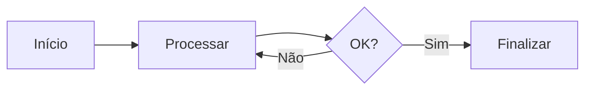
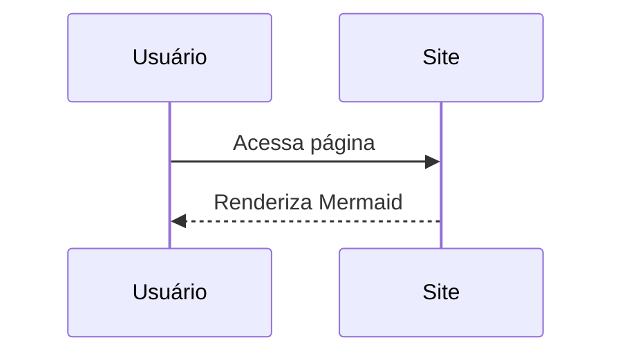

<!-- Carrega o Mermaid direto do CDN -->
https://cdn.jsdelivr.net/npm/mermaid@10/dist/mermaid.min.js</script>

# Teste Mermaid

Se este gráfico aparecer desenhado (e não como texto), o Mermaid está funcionando corretamente no GitHub Pages.

---

## 🔹 Diagrama de Fluxo

---

## 🔹 Diagrama de Sequência

